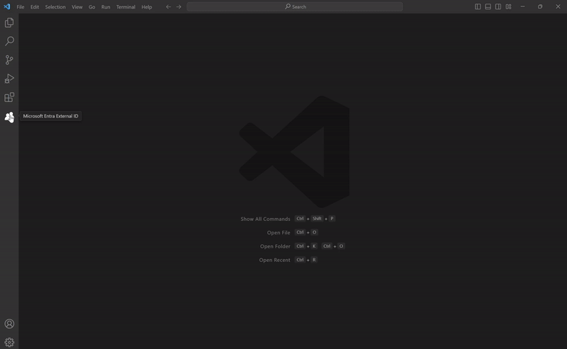
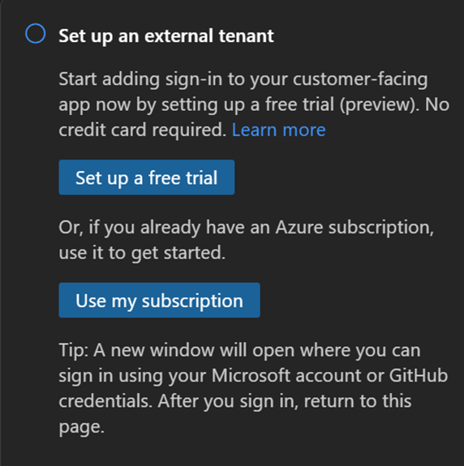
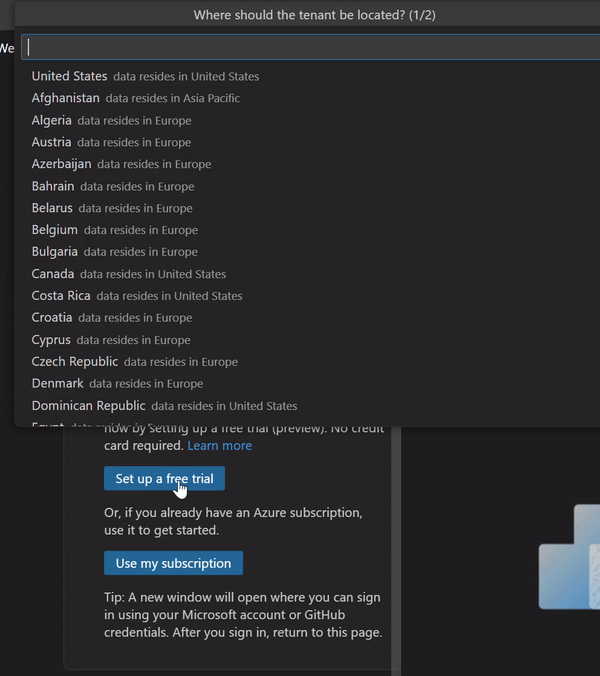
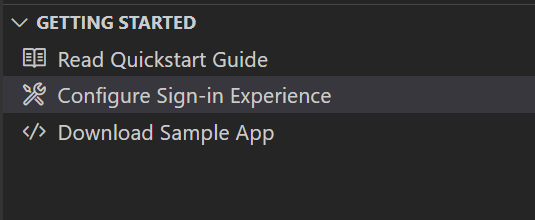
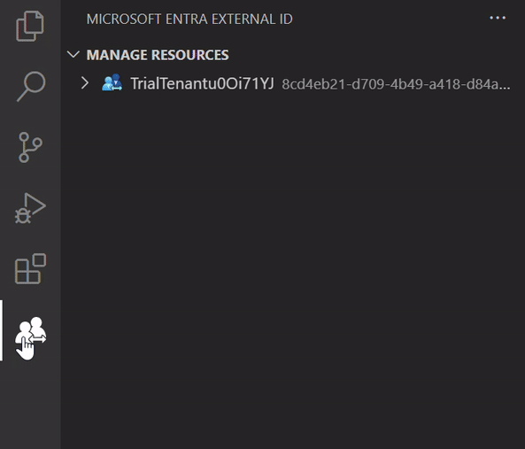

# Microsoft Entra External ID Extension for Visual Studio Code (Preview) 

The Microsoft Entra External ID extension for Visual Studio Code lets you quickly add authentication to applications for customer identity and access management (CIAM) scenarios. You can set up a customized, branded sign-in experience for external users of applications without leaving the development environment. 

This extension provides a quick basic setup that automatically creates a tenant for your application and prepares it for your users. It also streamlines your workflow by automatically populating values such as application IDs into your configuration file for a smoother setup process.

## Getting Started

Microsoft Entra External ID is a service that can be added on to an existing Azure subscription.  If you don’t already have an Azure subscription, you can set up a free trial of Microsoft Entra External ID within VS code and get started by configuring a sample app. 

For more information about Microsoft Entra External ID and how to use the extension, see Get started with [Microsoft Entra External ID extension for Visual Studio Code](https://learn.microsoft.com/en-gb/entra/external-id/customers/quickstart-trial-setup).  

### Installing the extension 

1. Download and install the Microsoft Entra External ID extension for Visual Studio Code. 

2. Wait for the extension to finish installing. When prompted, reload Visual Studio Code. 

3. Once completed, you will see an icon for Microsoft Entra External ID in the Activity Bar. 

    a. If your activity bar is hidden, you won't be able to see the extension icon. Show the Activity Bar by clicking View > Appearance > Show Activity Bar 

### Using the extension 

A step by step series of examples that tell you how to get a development environment running

1. On the Visual Studio Code Welcome page, under **Walkthroughs**, select **Get started with Microsoft Entra External ID**. Alternatively, you can access the walkthrough directly by clicking on the extension’s icon and selecting **Open extension walkthrough from Help and feedback** section in the explorer view. 

2. The get started page will guide you through the setup process. This setup can be run multiple times, allowing you to configure the sign-in experience and download sample apps as needed. For detailed steps for using the extension, refer to the [documentation](https://go.microsoft.com/fwlink/?linkid=2257700).  

## Overview  

Integrating authentication into your customer-facing applications is a crucial step in securing resources and customer data. The Microsoft Entra External ID extension for Visual Studio Code helps you quickly implement a solution for customized sign-in and secure access to your application right within the development environment. 

Based on whether you have an existing Azure account, you can get started by selecting one of the following: 

- If you don't already have an Azure Account, select **Set up a free trial**. 

- If you already have an Azure account, select **Use my subscription**.  

### Free trial option 

Microsoft Entra External ID provides a dedicated tenant that contains your customer-facing apps, External ID resources, and directory of user accounts. You can create a tenant from within this extension even if you don’t already have an Azure account, by setting up a free trial.  

If you have an Azure subscription and are creating a tenant with customer configuration for the first time, you will also have an option to create a trial tenant. 

### Sign-up and sign-in experience and branding 

In the guided walkthrough, you can quickly configure sign-in methods and design the look and feel of the user experience. Choose a background color, image, or logo to be displayed in sign-up pages.   

You can also configure sign-in experiences in the **Getting Started** section in the explorer view. 

### Sample applications 

The extension contains several code samples that demonstrate how authentication is implemented in different application types and development languages. You can choose one of the following application samples from the within the extension and it will automatically be configured with your sign-in experience: 

- Single Page Application (SPA): JavaScript, React, Angular 

- Web app: ASP\.NET Core 

### Explorer view 

The explorer view displays the resources in your tenant and lets you quickly view their properties. You can view configuration information about your registered applications, authentication user flows, and company branding configuration. You can also navigate directly to the Microsoft Entra admin center from the explorer view if you need to further configure or manage the resource. 

## Issue reporting and feedback 
- **Report Issues**: Encountered a bug or facing a challenge with our extension? Report it directly on our [GitHub repository](https://github.com/microsoft/vscode-ms-entra/issues). 

- **Provide feedback**: Have suggestions or want to share your thoughts on the extension? We’d love to hear from you! Fill out our [feedback form](https://go.microsoft.com/fwlink/?linkid=2257518) to let us know how we can improve or what you love about the extension. 

## Telemetry 
VS Code collects usage data and sends it to Microsoft to help improve our products and services. Read our privacy statement to learn more. If you don’t wish to send usage data to Microsoft, you can set the `telemetry.enableTelemetry` setting to false.. Learn more about telemetry handling in VS Code [FAQ](https://code.visualstudio.com/docs/supporting/faq#_how-to-disable-telemetry-reporting). 

## Support and resources 

[GitHub Repository](https://github.com/microsoft/vscode-ms-entra) 

[Microsoft Entra External ID Developer Center](https://aka.ms/ciam/dev) 

[Microsoft Entra External ID documentation](https://learn.microsoft.com/en-us/entra/external-id) 

[Videos](https://aka.ms/ciamvscode/WatchVideos) 

## License

This project is licensed under the MIT license - see the [LICENSE](LICENSE) file for details
